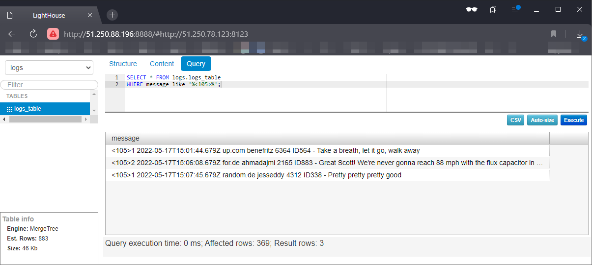
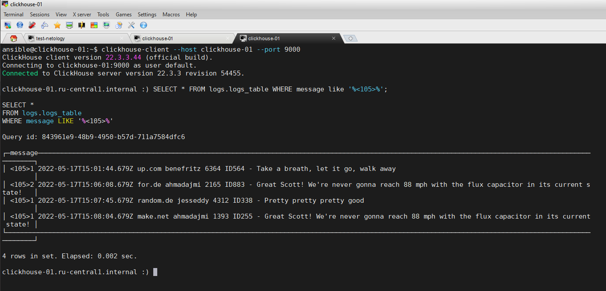

В [playbook/site.yml](playbook/site.yml) добавлен PLAY с `tags=lighthouse`, устанавливающий lighthouse.  

Для работы с ВМ в Yandex Cloud подготовлен инвентори [playbook/inventory/yandex.yml](playbook/inventory/yandex.yml).  

Подготовленные ВМ:    

| Hostname          | Public IP     | Private IP    | Software           |
|-------------------|---------------|---------------|--------------------|
| clickhouse-01     | 51.250.78.123 | 192.168.10.11 | Clickhouse         |
| vector-01         | 51.250.70.13  | 192.168.10.12 | Vector             |
| lighthouse-01     | 51.250.88.196 | 192.168.10.13 | Lighthouse & Nginx | 


Установка ППО плейбуком:  
<details>
    <summary>ansible-playbook -i inventory/yandex.yml -u ansible site.yml</summary>

```shell
vagrant@test-netology:/playbook$ ansible-playbook -i inventory/yandex.yml -u ansible site.yml

PLAY [Install Clickhouse] **************************************************************************************************************************

TASK [Clickhouse. Get clickhouse distrib] **********************************************************************************************************
changed: [clickhouse-01] => (item=clickhouse-client)
changed: [clickhouse-01] => (item=clickhouse-server)
failed: [clickhouse-01] (item=clickhouse-common-static) => {"ansible_loop_var": "item", "changed": false, "dest": "./clickhouse-common-static_22.3.3.44_all.deb", "elapsed": 1, "item": "clickhouse-common-static", "msg": "Request failed", "response": "HTTP Error 404: Not Found", "status_code": 404, "url": "https://packages.clickhouse.com/deb/pool/stable/clickhouse-common-static_22.3.3.44_all.deb"}

TASK [Clickhouse. Get clickhouse distrib] **********************************************************************************************************
changed: [clickhouse-01] => (item=clickhouse-client)
ok: [clickhouse-01] => (item=clickhouse-server)
ok: [clickhouse-01] => (item=clickhouse-common-static)

TASK [Clickhouse. Install packages] ****************************************************************************************************************
changed: [clickhouse-01] => (item=./clickhouse-common-static_22.3.3.44_amd64.deb)
changed: [clickhouse-01] => (item=./clickhouse-client_22.3.3.44_all.deb)
changed: [clickhouse-01] => (item=./clickhouse-server_22.3.3.44_all.deb)

TASK [Clickhouse. Modify config.xml] ***************************************************************************************************************
changed: [clickhouse-01]

TASK [Clickhouse. Flush handlers] ******************************************************************************************************************

RUNNING HANDLER [Start clickhouse service] *********************************************************************************************************
changed: [clickhouse-01]

TASK [Clickhouse. Waiting while clickhouse-server is available...] *********************************************************************************
Pausing for 30 seconds (output is hidden)
(ctrl+C then 'C' = continue early, ctrl+C then 'A' = abort)
ok: [clickhouse-01]

TASK [Clickhouse. Create database] *****************************************************************************************************************
changed: [clickhouse-01]

TASK [Clickhouse. Create table] ********************************************************************************************************************
changed: [clickhouse-01]

PLAY [Install Vector] ******************************************************************************************************************************

TASK [Vector. Create work directory] ***************************************************************************************************************
changed: [vector-01]

TASK [Vector. Get Vector distributive] *************************************************************************************************************
changed: [vector-01]

TASK [Vector. Unzip archive] ***********************************************************************************************************************
changed: [vector-01]

TASK [Vector. Install vector binary file] **********************************************************************************************************
changed: [vector-01]

TASK [Vector. Check Vector installation] ***********************************************************************************************************
changed: [vector-01]

TASK [Vector. Create etc directory] ****************************************************************************************************************
changed: [vector-01]

TASK [Vector. Create Vector config vector.yaml] ****************************************************************************************************
changed: [vector-01]

TASK [Vector. Create vector.service daemon] ********************************************************************************************************
changed: [vector-01]

TASK [Vector. Modify vector.service file ExecStart] ************************************************************************************************
changed: [vector-01]

TASK [Vector. Modify vector.service file ExecStartPre] *********************************************************************************************
changed: [vector-01]

TASK [Vector. Create user vector] ******************************************************************************************************************
changed: [vector-01]

TASK [Vector. Create data_dir] *********************************************************************************************************************
changed: [vector-01]

TASK [Vector. Remove work directory] ***************************************************************************************************************
changed: [vector-01]

RUNNING HANDLER [Start Vector service] *************************************************************************************************************
changed: [vector-01]

PLAY [Install Lighthouse] **************************************************************************************************************************

TASK [Lighthouse. Pre-install nginx & git client] **************************************************************************************************
changed: [lighthouse-01]

TASK [Lighthouse. Clone source code by git client] *************************************************************************************************
changed: [lighthouse-01]

TASK [Lighthouse. Prepare nginx config] ************************************************************************************************************
changed: [lighthouse-01]

RUNNING HANDLER [Start Lighthouse service] *********************************************************************************************************
changed: [lighthouse-01]

PLAY RECAP *****************************************************************************************************************************************
clickhouse-01              : ok=7    changed=6    unreachable=0    failed=0    skipped=0    rescued=1    ignored=0
lighthouse-01              : ok=4    changed=4    unreachable=0    failed=0    skipped=0    rescued=0    ignored=0
vector-01                  : ok=14   changed=14   unreachable=0    failed=0    skipped=0    rescued=0    ignored=0
```

</details>

Vector генерирует данные для отправки в БД Clickhouse с помощью источника данных `type: demo_logs`. 
Шаблон конфига [playbook/templates/vector/vector.yaml.j2](playbook/templates/vector/vector.yaml.j2).  

GUI Lighthouse с данными из БД Clickhouse:  
  
  
  
  
CLI clickhouse-client с данными из БД Clickhouse:
  
  
   
  


[playbook/site.yml](playbook/site.yml) содержит 3 play'я task'ов. Каждый Play содержит в себе task'и по установке 
Clickhouse, Vector и Lighthouse соответственно. Каждый play можно выполнить отдельно, используя тэги: `clickhouse`, 
`vector` и `lighthouse`.  
Плейбук использует 4 файла с переменными: 3 файла для каждой из групп хостов индивидуально:  
- [playbook/group_vars/clickhouse/clickhouse_vars.yml](playbook/group_vars/clickhouse/clickhouse_vars.yml)  
- [playbook/group_vars/vector/vector_vars.yaml](playbook/group_vars/vector/vector_vars.yaml)  
- [playbook/group_vars/lighthouse/lighthouse_vars.yaml](playbook/group_vars/lighthouse/lighthouse_vars.yaml)  
и один файл, применяемый для всез групп хостов:  
- [playbook/group_vars/all/all_vars.yml](playbook/group_vars/all/all_vars.yml)    

Для конфигурации Vector и Nginx используются шаблоны конфигов:  
- [playbook/templates/vector/vector.yaml.j2](playbook/templates/vector/vector.yaml.j2)
- [playbook/templates/nginx/ligthouse.conf.j2](playbook/templates/nginx/ligthouse.conf.j2)   
   